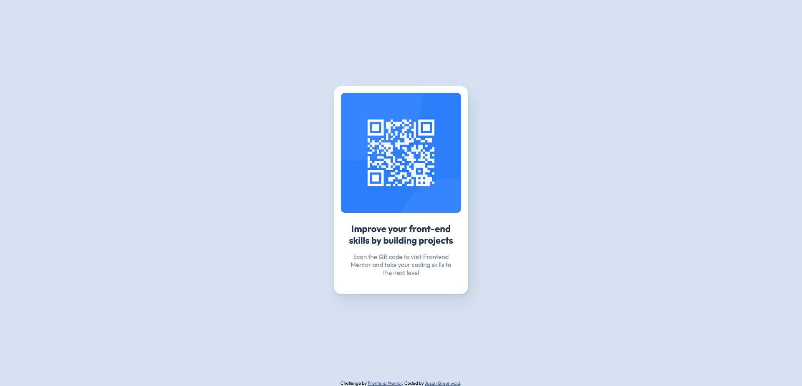

# Frontend Mentor - QR code component solution

This is a solution to the [QR code component challenge on Frontend Mentor](https://www.frontendmentor.io/challenges/qr-code-component-iux_sIO_H). Frontend Mentor challenges help you improve your coding skills by building realistic projects. 

## Table of contents

- [Overview](#overview)
  - [Screenshot](#screenshot)
  - [Links](#links)
- [My process](#my-process)
  - [Built with](#built-with)
  - [What I learned](#what-i-learned)
  - [Continued development](#continued-development)
  - [Useful resources](#useful-resources)
- [Author](#author)
- [Acknowledgments](#acknowledgments)

## Overview

TBD

### Screenshot

### Links

- Solution URL: https://www.frontendmentor.io/solutions/qr-code-component-B1u7o3BB5
- Live Site URL: https://jaycgreenwald.github.io/qr-code-component-fm/
- Repository Site URL: https://github.com/jaycgreenwald/qr-code-component-fm

## My process

### Built with

- Semantic HTML5 markup
- CSS custom properties
- Flexbox
- Mobile-first workflow

### What I learned

I learned that I have a lot to learn still! 

I was thankful for the article [Chasing the Pixel-Perfect Dream](https://www.joshwcomeau.com/css/pixel-perfection/). It put me at ease about how I would accomplish this task. The section on measuring was very useful. I used Adobe Illustrator to measure the dimensions of the design images. Once that was done I was well on my way.

I came away with a better understanding of how a work flow might look. I was jumping around (especially in the CSS) and one tweak would create a new problem elsewhere. Then the fix for that would break something new. Also, I need to slow down. 

I discovered the Responsive Design Mode in the Firefox Developer Tools. 

I learned how to commit changes to my repo and how to publish said repo using GitHub Pages. It was a great feeling seeing my code live on a webpage!

### Continued development

I would like to focus on responsive design techniques to get on more solid footing. Did I code a project that is responsive? I'm still not sure. The other area I need to work on is learning about accessibility. I don't know if my solution is accessible or how to make that determination. I'll also seek feedback which may provide additional areas of focus.

### Useful resources

- [Chasing the Pixel-Perfect Dream by Josh W. Comeau](https://www.joshwcomeau.com/css/pixel-perfection/) - In my limited experience, I have only built projects that I designed. I never had to code the design that was given to me. The idea that the finished product may not exactly match the design shifted my whole perspective from "How can I do this?" to "I can do this!". 
- [How to get the most out of Frontend Mentor by Matt Studdert](https://medium.com/frontend-mentor/how-to-get-the-most-out-of-frontend-mentor-bdd6fdc25cb8) - Invaluable starting document to, well, get the most out of Front End Mentor. I suspect I'll be referring to this over and over.
- [Git and GitHub explained for beginners by CoderCoder](https://www.youtube.com/watch?v=8Dd7KRpKeaE) - Jessica Chan has a number of very informative videos for front-end coders. I used this video to get up and running with GitHub.

## Author

- Frontend Mentor - [@jaycgreenwald](https://www.frontendmentor.io/profile/jaycgreenwald)
- Twitter - [@jaycgreenwald](https://www.twitter.com/jaycgreenwald)

## Acknowledgments

Thank you to Frontend Mentor for providing this amazing resource and to the people who created the resources listed above.